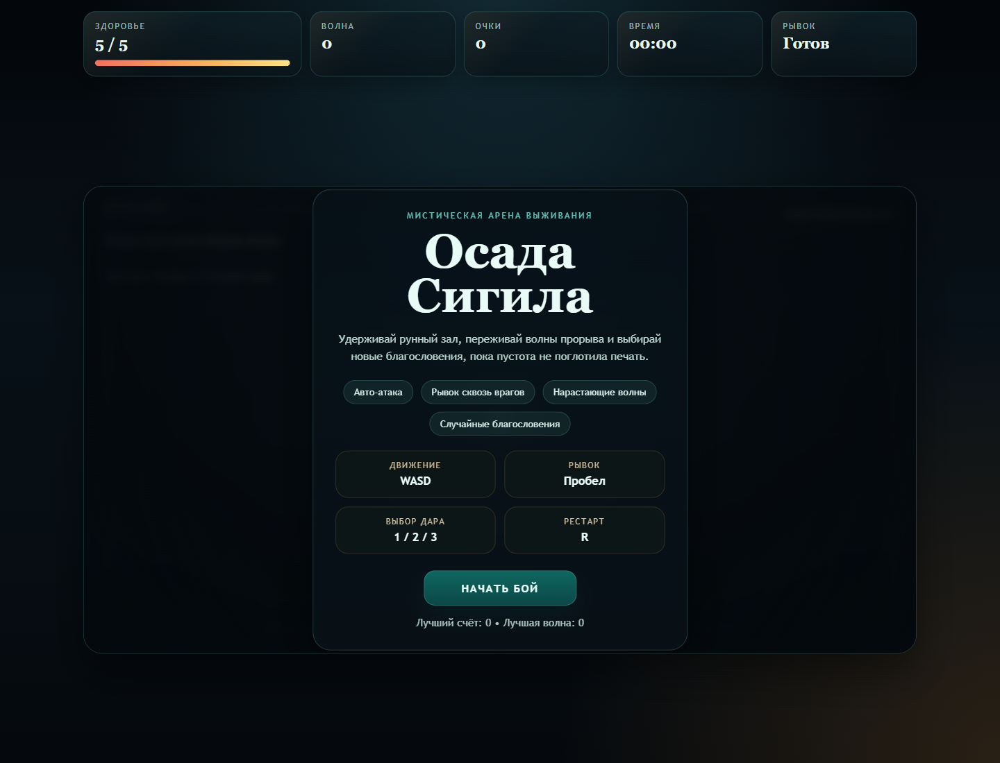
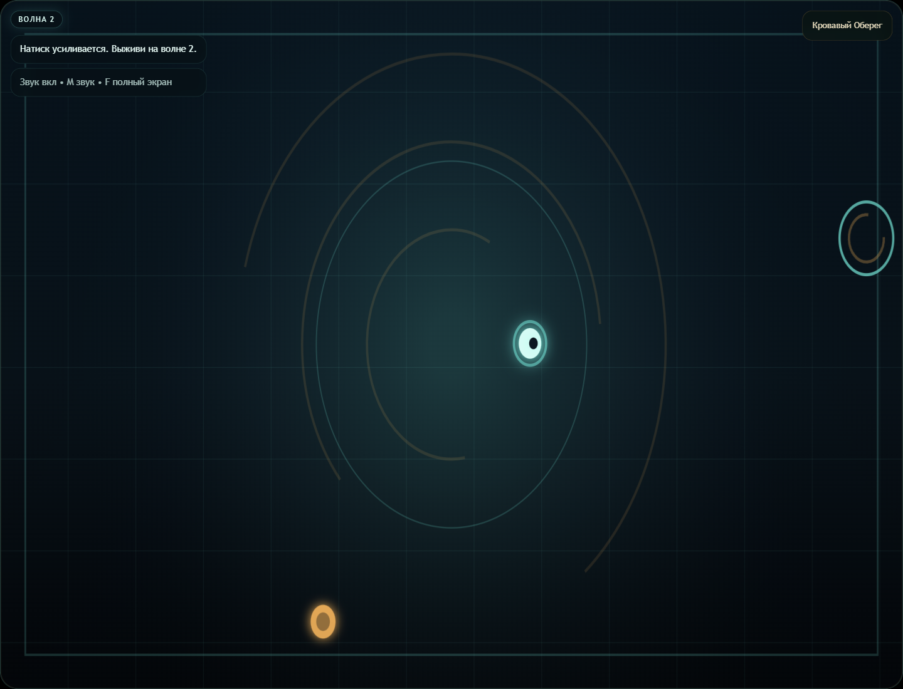
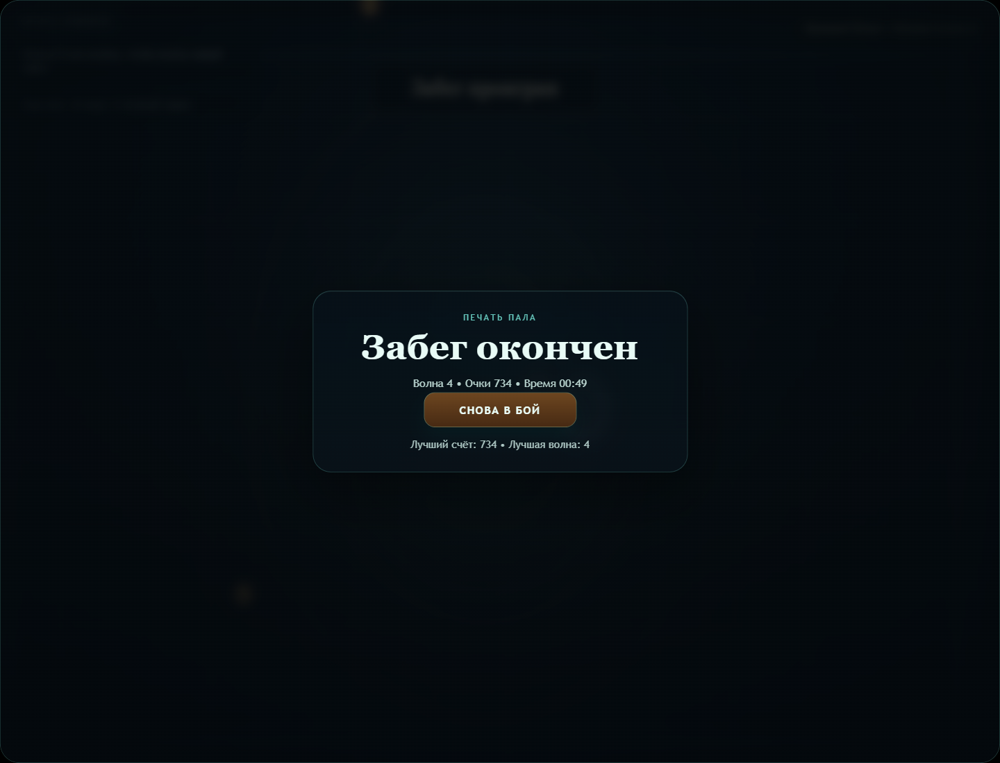

# Осада Сигила

Небольшой, но отполированный 2D roguelike-survivor на ванильном JavaScript и Vite. Игрок удерживает рунный зал, переживает нарастающие волны врагов, собирает осколки и выбирает благословения между волнами.

## Что внутри

- top-down арена с отзывчивым движением
- авто-атака по ближайшей цели
- рывок с короткой неуязвимостью
- несколько типов врагов и мини-босс Sentinel
- случайные благословения между волнами
- HUD, стартовый экран, экран смерти и быстрый рестарт
- процедурные визуальные эффекты и лёгкие синт-звуки
- полный перевод интерфейса на русский

## Скриншоты







## Как играть

- `WASD` или стрелки: движение
- `Пробел`: рывок
- `1`, `2`, `3` или клик: выбрать благословение
- `R`: начать заново после поражения
- `F`: полный экран
- `M`: включить или выключить звук

Цель проста: продержаться как можно дольше, закрывать волны, собирать осколки и собирать сильную комбинацию благословений.

## Локальный запуск

```bash
npm install
npm run dev
```

После запуска открыть адрес Vite, обычно `http://localhost:5173/`.

## Production build

```bash
npm run build
```

## Деплой на GitHub Pages

В репозитории уже добавлен workflow для GitHub Pages. После пуша в `main` GitHub Actions соберёт Vite-проект и опубликует его.

Ожидаемый адрес сайта:

[https://darmenbaevrasul.github.io/Rogalik_Shar/](https://darmenbaevrasul.github.io/Rogalik_Shar/)

Если GitHub попросит подтверждение Pages:

1. Открой `Settings` репозитория.
2. Перейди в `Pages`.
3. В `Build and deployment` выбери `GitHub Actions`.

## Структура

- [src/main.js](./src/main.js) — UI-обвязка, HUD, экраны, browser hooks
- [src/game/engine.js](./src/game/engine.js) — основная игровая логика
- [src/game/render.js](./src/game/render.js) — canvas-рендеринг и визуальные эффекты
- [src/game/blessings.js](./src/game/blessings.js) — благословения и их эффекты

## Примечания

- Внешние ассеты не использовались: визуал и звук сделаны процедурно.
- Игра рассчитана на короткие, быстрые забеги на 2–5 минут.
